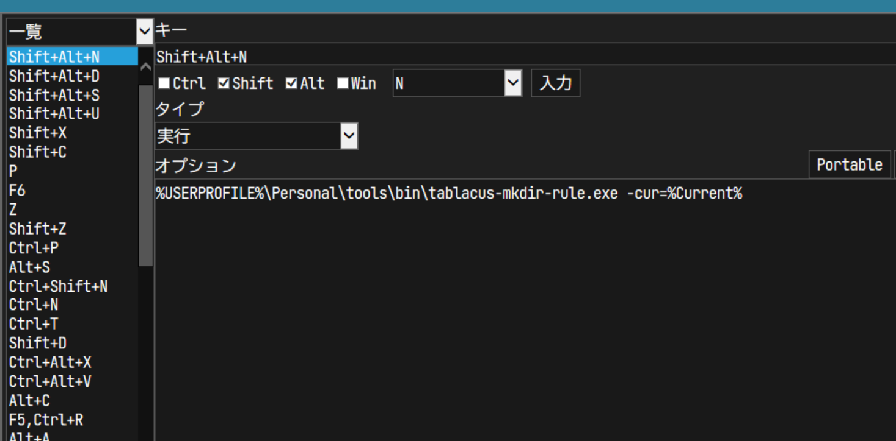

# README

Command line tool for [Tablacus Explorer](https://tablacus.github.io/explorer.html).

- Show menu to select folder name prefix.
- Make new directory with selected prefix and timestamp ( `yyyyMMdd_[timestamp]_` ).
    - Names are defined with `rule.yml` in the directory.
    - Without `rule.yml`, nothing happens.

